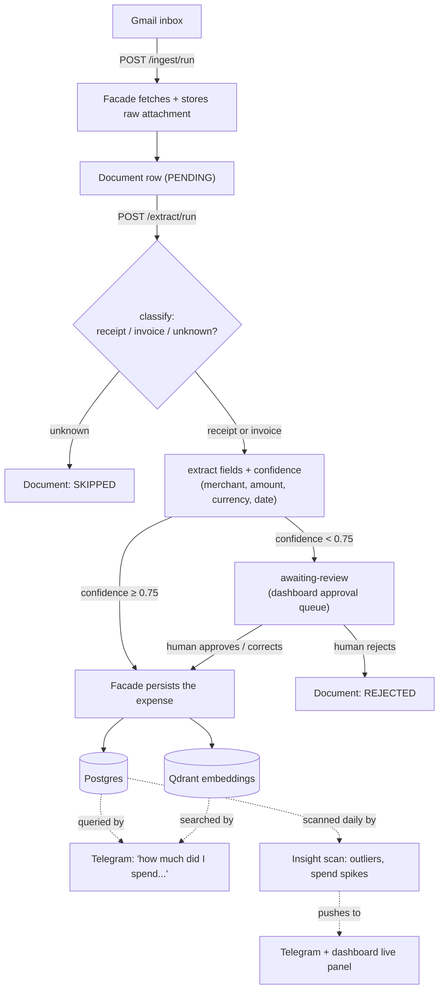
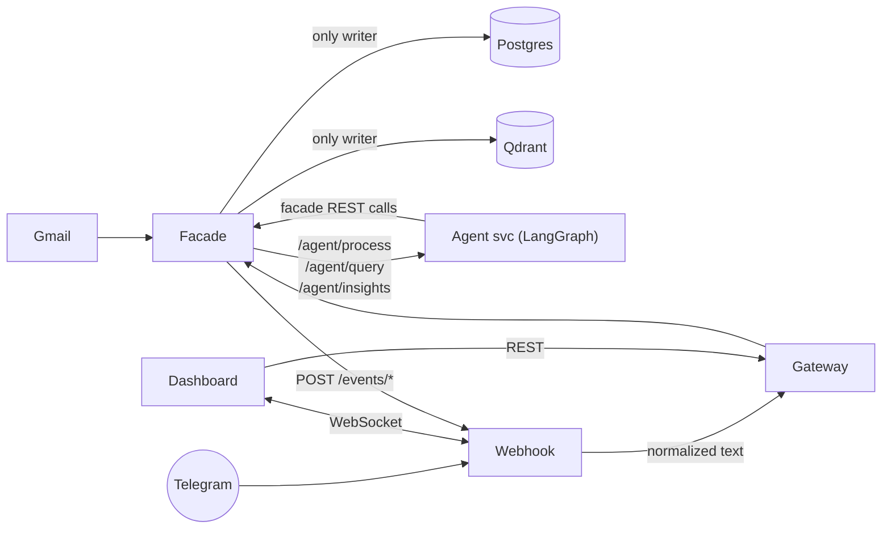
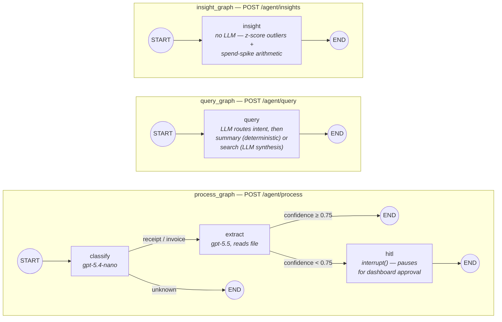

# ai-pa-agent — Personal Expense Agent

A personal AI expense assistant, built as a portfolio/learning project. Non-commercial. See
[`CLAUDE.md`](./CLAUDE.md) for the full engineering brief this project was built against —
architecture rules, phase plan, and the reasoning behind them.

## The problem this solves

Receipts and invoices land in Gmail and then just... sit there. Answering "how much did I spend
on groceries last month" or "when does the washing machine warranty expire" means manually
digging through an inbox — nobody actually does this, so nobody has a real picture of their own
spending until it's tax season or a warranty has already lapsed.

This project automates the boring part (read the inbox, figure out what a document is, pull the
numbers out of it, file it) and puts a natural-language interface on top of the result, so the
answer to "how much did I spend last month" is a Telegram message away instead of an inbox
search. Two user-facing surfaces sit on the same data:

- **Telegram bot** — ask a question in plain language ("колco похарчих за храна тоя месец"),
  get an answer synthesized from real stored data, not a guess.
- **Dashboard** — browse expenses, review/correct anything the extraction wasn't confident about
  (human-in-the-loop), and see a live feed of spending anomalies as they're detected.

The system also runs a standing daily check for spending anomalies (a merchant charge far above
that merchant's own history, a week that's well above the usual weekly spend) and pushes those
proactively, rather than waiting to be asked.

## Business flow

End-to-end: a document lands in Gmail, gets turned into a stored expense (with a human checkpoint
when the AI isn't confident), and from then on is queryable and monitored.



## Architecture



- **Gateway** (Spring Cloud Gateway) — single entry point, routes `/api/**` → facade
  (`StripPrefix=1`). JWT auth is scaffolded (`JWT_SECRET` env var) but **not wired up yet** —
  the gateway is routing-only today.
- **Facade** (Spring Boot + Spring AI) — the expense domain. The only service that writes to
  Postgres or Qdrant. Owns extraction orchestration, HITL review, insight scheduling, and every
  domain REST endpoint.
- **Agent svc** (Python + LangGraph + FastAPI) — orchestration only. Three graphs: document
  processing (classify → extract → HITL), natural-language query, and scheduled insight scan.
  Calls facade's real domain endpoints over HTTP — never touches Postgres/Qdrant directly.
- **Webhook svc** (Node.js + Express + `ws`) — Telegram webhook receiver, translates updates to
  `{userId, text}` and forwards to the gateway; also runs the WebSocket channel the dashboard
  listens on for live expense/insight pushes.
- **Dashboard** (Angular) — expense overview with charts, live insight panel, HITL approval
  queue.

## Services

| Service   | Tech                       | Port (local) | Key endpoints |
|-----------|-----------------------------|:---:|---|
| gateway   | Java 21, Spring Cloud Gateway | 8080 | `/api/**` → facade |
| facade    | Java 21, Spring Boot, Spring AI | 8081 | `POST /ingest/run`, `POST /extract/run`, `GET /documents/awaiting-review`, `POST /documents/{id}/approve\|reject`, `GET /expenses`, `GET /expenses/summary`, `GET /expenses/search`, `POST /expenses/query`, `POST /insights/run` |
| agents    | Python 3.12, LangGraph, FastAPI | 8000 | `POST /agent/process`, `POST /agent/resume/{thread_id}`, `POST /agent/query`, `POST /agent/insights` |
| webhook   | Node.js 20, Express, ws     | 3000 | `POST /webhook/telegram`, `POST /events/expense-created`, `POST /events/insight`, `GET /ws` |
| dashboard | Angular                     | 4200 | SPA — talks to gateway + webhook `/ws` |
| postgres  | Postgres 16                 | 5434→5432 | expense domain data + LangGraph checkpoints |
| qdrant    | Qdrant                      | 6333/6334 | expense embeddings (semantic search) |

Each service directory has its own short `README.md` with more detail. For the agent design
specifically — which agentic patterns (router, HITL, critic, planner, supervisor) are in use,
and why the ones that aren't present were left out — see
[`agents/PATTERNS.md`](./agents/PATTERNS.md).

## Agent graphs (LangGraph)

The agent svc is three separate LangGraph state machines (`graph/builder.py`), sharing one
`AgentState` and one checkpointer, each hit through its own FastAPI route:



`hitl`'s `interrupt()` is the one place a graph pauses mid-run — it relies on the checkpointer
(`PostgresSaver` in production) to survive until `POST /agent/resume/{thread_id}` sends
`Command(resume=...)`. The other two graphs are single-pass, no pause/resume involved.

## Quickstart (local)

```bash
cp .env.example .env      # fill in OPENAI_API_KEY at minimum
docker compose up --build
```

| URL | What |
|---|---|
| http://localhost:4200 | Dashboard |
| http://localhost:8080 | Gateway (client entry point) |
| http://localhost:8081/health | Facade health |
| http://localhost:8000/health | Agent svc health |

To get a Telegram chat working: create a bot via `@BotFather`, set `TELEGRAM_BOT_TOKEN`, message
the bot once, then read `docker compose logs webhook` for the logged `chat.id` — that's
`TELEGRAM_CHAT_ID`. (The number in a `web.telegram.org` URL fragment can be the *bot's own*
account id, not yours — don't assume it without checking the logs.)

For a real VPS deploy (persistent data, auto-restart, Caddy reverse proxy + HTTPS, network
isolation, secrets hygiene) see [`DEPLOY.md`](./DEPLOY.md) instead of this section.

## Environment variables

See [`.env.example`](./.env.example) for the full annotated list. Required for the core
ingest → extract → persist pipeline: `POSTGRES_*`, `OPENAI_API_KEY`,
`GMAIL_CLIENT_ID/SECRET/REFRESH_TOKEN`. Everything under
"Cockpit channels" and "Observability" is optional — the stack runs without Telegram or
LangSmith configured, just with those features inert.

## Testing

| Service | Command | Covers |
|---|---|---|
| agents | `cd agents && pip install -r requirements.txt -r requirements-dev.txt && pytest` | Pure-logic node behavior: insight anomaly math, query answer formatting, classify/extract error handling (22 tests) |
| facade | `cd facade && ./gradlew test` | InsightService fan-out decision against mocked `AgentClient`/`WebhookEventPublisher` (4 tests) |
| dashboard | `cd dashboard && npm test` | Component scaffolding (Vitest) |

LLM calls themselves aren't unit tested — the graphs are integration-tested manually against the
real stack (`docker compose up`, then hit the facade endpoints). Unit tests target the
deterministic logic around the LLM calls: routing decisions, confidence thresholds, anomaly math,
answer formatting.

No local JDK/Gradle install? Run the wrapper in a container instead:
`docker run --rm -v "$PWD":/work -w /work eclipse-temurin:21-jdk ./gradlew test --no-daemon`.
On Apple Silicon under Docker Desktop, some JDK 21 images crash on startup (`SIGILL` in
`registerNatives`) unless SVE is disabled — add `-e JAVA_TOOL_OPTIONS=-XX:UseSVE=0` to the
`docker run` command above if you hit that.

## Known gaps (by design, for a demo project)

- **Insight agent covers anomalies only** (per-merchant spend outliers via z-score,
  week-over-trailing-average spend spikes) — not renewals or expiring warranties/promos. The
  extraction pipeline only captures `merchant/amount/currency/date` today; renewal/warranty
  insights would need a wider extraction schema (and possibly a new document type) first.
  Intentionally left out for this demo.
- Gateway has no JWT auth wired up yet — routing only.
- No AWS/Bedrock profile — local Qdrant + OpenAI API key only.
- No CrewAI comparison system.
